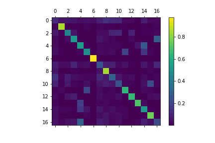
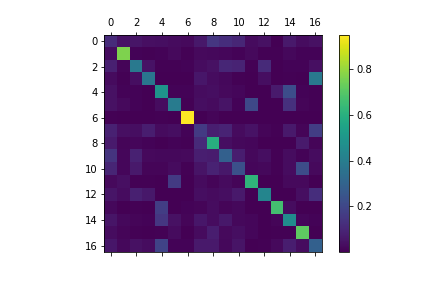
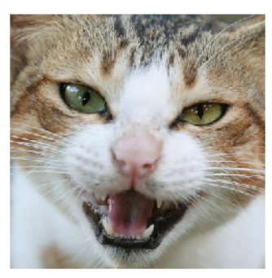
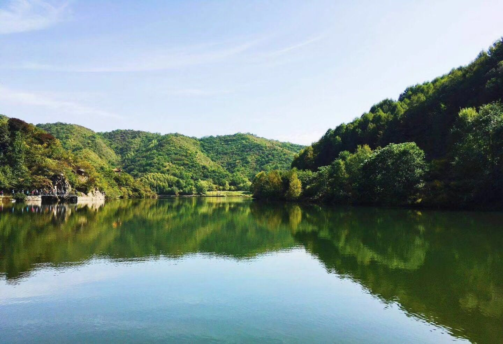
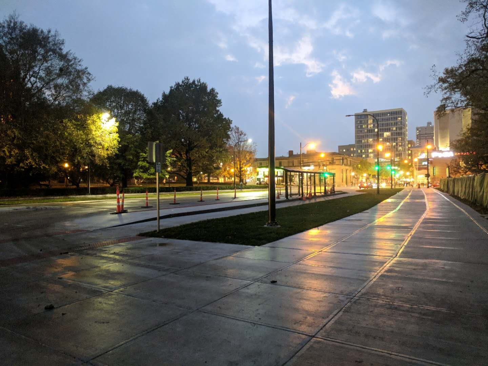
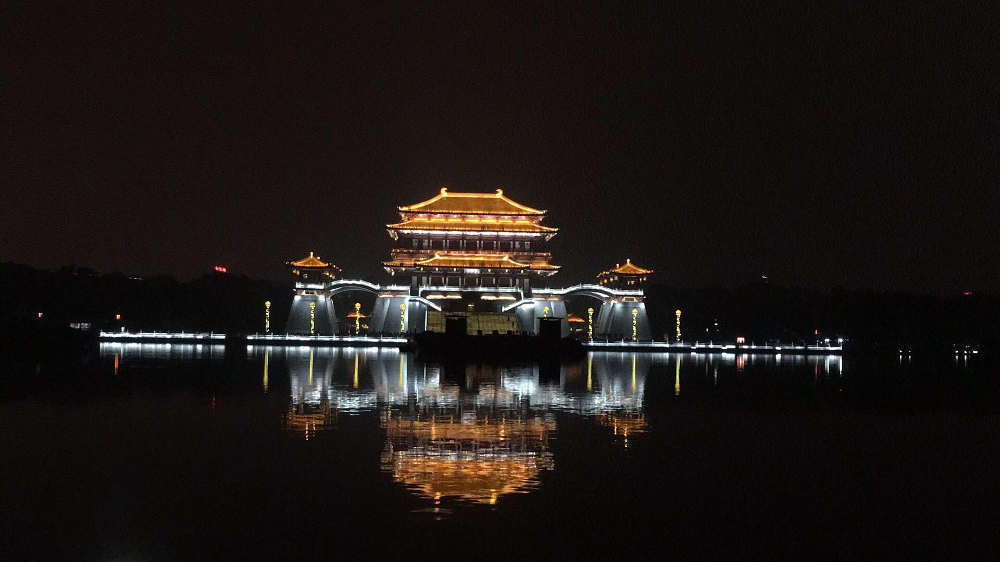
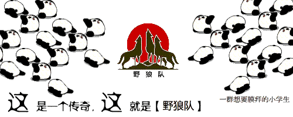
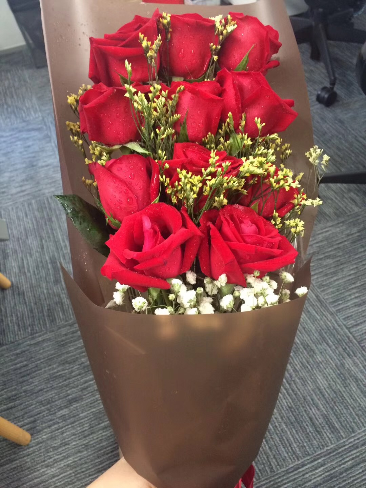

# ImageTagging
project results demo. Already transferred on Android app.

This is a similar edition of Apple's Photo Classification function.

Related News:
+ [iPhone相册会自动归类内衣照？这项机器学习功能让妹子们炸了](http://dy.163.com/v2/article/detail/D25POQ8F0511DSSR.html)

Content:
- [function](#function)
- [Dataset details](#dataset-details)
- [confusion matrix](#confusion-matrix)
- [prediction time analysis](#prediction-time-analysis)
- [test cases](#test-cases)
#  function
+ Give a searching class name, then predict all the photos and cluster and copy all the photos
matching the class to a new folder.
+ Give a new photo, then predicate the photo and return the predicted class names.
Finally give the user a option to choose which class name to classify into.
#  dataset details
The origin datasets has ~130w images and 21 classes.
Some modification on the origin dataset:
+ Remove 3 too abstract classes
+ Merge some similar classes
+ Add people class Using MicroSoft Face Detection API

|phase|percent|image number|
|:------:|:-----:|:----:|
|total|100|809070|
|train|90|728165|
|valid|1|8099|
|test|9|72815|

Tips: The percent is used to choose random samples on every single class to keep 
data balanced as much as possible. And actually, every class has a loss weight which 
is the invert percent of the class image number of the total image number.
We also tried manually choose the loss weight as a super parameter. We manually 
enlarge the loss weight for the people class to try to get better performance on the 
people class. The results didn't show coherent improvement under some tries. 

# confusion matrix
|Vgg19_bn|mobilenet|
|----|-----|
||

# prediction time analysis
The measure is always second(s), it's an average of 100 times.

|name|init time|load time|cpu|gpu|
|:-----:|:-----:|:-----:|:-----:|:-----:|
|mobilenet|0.0545|0.0178|0.3811|0.1786|
|vgg19_bn|1.709|3.584|1.308|0.006|

# test cases
|img|predictions|
|:----:|:-----:|
||0.5059	风景图片\n0.3084	建筑图片\n0.0484	清新唯美图片|
||0.4601	清新唯美图片\n0.2996	头像\n0.101	人物图片|
||0.9781	动物图片\n0.0087	人物图片\n0.0048	表情图片|
||0.8724	风景图片\n0.0302	背景图片\n0.0289	植物图片|
||0.6523 建筑图片\n0.2267 风景图片\n0.0263 其他图片|
||0.6107	建筑图片\n0.3489 风景图片\n0.0125 其他图片|
||0.933	动物图片\n0.0206 头像\n0.0156 人物图片|
||0.8418	建筑图片\n0.0998	风景图片\n0.0125	装修图片|
||0.975	食品图片\n0.0068	生活图片\n0.0057	清新唯美图片|
||.7052	表情图片\n0.1007	其他图片\n0.0821	节日图片|
||0.6975	动物图片\n0.1001	头像\n0.0813	表情图片|
||0.2465	花卉图片\n0.2164	节日图片\n0.1387	生活图片|
||0.6888	表情图片\n0.0976	动物图片\n0.0875	其他图片|
||0.6222  动物图片\n0.1755  表情图片\n0.0571  人物图片|

